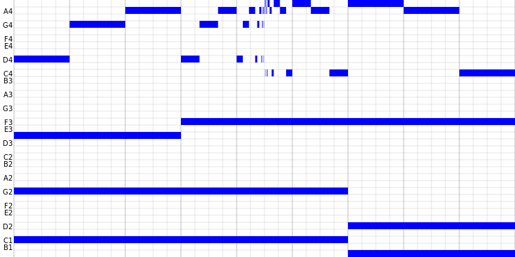

# mm

mm is for making melodies!

mm is a DSL used to notate melodies and harmonies, although the system easily
generalizes to anything else.

    it = 3 (melody | chords)

    melody = 1/3 (D, G, A, melody, A#, A, C)
    chords = (2C-1, A#-2 | D#, 2F | 2G-1, D-1)-1

## License

Licensed under either of

* Apache License, Version 2.0
  ([LICENSE-APACHE](LICENSE-APACHE) or <http://www.apache.org/licenses/LICENSE-2.0>)
* MIT license
  ([LICENSE-MIT](LICENSE-MIT) or <http://opensource.org/licenses/MIT>)

at your option.

## Contribution

Unless you explicitly state otherwise, any contribution intentionally submitted
for inclusion in the work by you, as defined in the Apache-2.0 license, shall be
dual licensed as above, without any additional terms or conditions.
